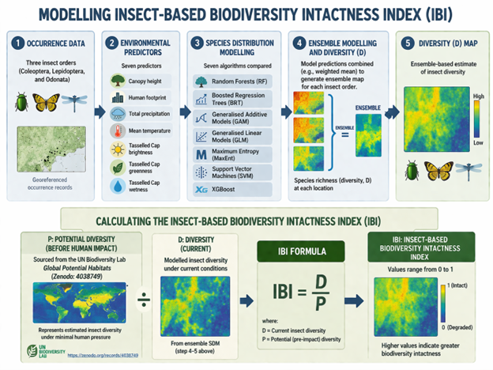

# Insect-Based Biodiversity Intactness Index (i-BII) for Africa
### Python-Based Continental Biodiversity Modeling Framework



The **Insect-Based Biodiversity Intactness Index (i-BII)** is a reproducible geospatial modeling framework designed to quantify and map patterns of insect biodiversity intactness across Africa. The workflow integrates species occurrence records, environmental predictor variables, spatially explicit machine learning models, spatial block cross-validation, and uncertainty assessment to generate continent-wide biodiversity intactness estimates.

The framework addresses major challenges in large-scale biodiversity modeling, including spatial sampling bias, spatial autocorrelation, uneven observation effort, and uncertainty in model predictions. The resulting products provide scientifically robust indicators that can support biodiversity monitoring, conservation planning, ecological assessment, and environmental policy development.

---

# Scientific Framework

The i-BII framework estimates biodiversity intactness as the ratio between:

- **Observed Biodiversity Suitability (D):** Ensemble model predictions representing current insect biodiversity conditions.
- **Potential Biodiversity Baseline (P):** A reference surface representing potential biodiversity under minimally disturbed ecological conditions.

The Biodiversity Intactness Index is calculated as:

\[
iBII = \frac{D}{P}
\]

where:

- \(iBII \in [0,1]\)
- Values approaching **1** indicate biodiversity conditions close to their potential state.
- Values approaching **0** indicate substantial biodiversity degradation relative to the potential baseline.

To improve interpretation and reliability, the workflow additionally quantifies spatial observational uncertainty and masks areas with insufficient observational support.

---

# Workflow Overview

The workflow is organized into modular processing stages that can be executed independently or as a complete end-to-end pipeline.


*Figure 1. End-to-end workflow for generating the Insect-Based Biodiversity Intactness Index (i-BII), from occurrence data preprocessing through ensemble modelling, uncertainty assessment, and final biodiversity intactness mapping.*

---

# Pipeline Architecture

## Stage 0 — Occurrence Data Preprocessing
**File:** `src/00_preprocess_occurrences.py`

Processes raw species occurrence datasets by:

- Applying spatial thinning to reduce clustering and sampling bias.
- Reprojecting records into an equal-area coordinate system (`ESRI:102022`).
- Merging occurrence datasets from multiple sources.
- Producing cleaned occurrence datasets suitable for model development.

### Inputs

- Species occurrence shapefiles
- Supplementary occurrence CSV datasets

### Outputs

- Spatially thinned occurrence dataset

---

## Stage 1 — Environmental Data Preparation
**File:** `src/01_data_prep.py`

Extracts environmental predictor variables for presence and pseudo-absence observations.

### Functions

- Raster extraction
- Covariate harmonization
- Missing value handling
- Feature matrix generation

### Outputs

- Training feature matrix
- Presence/pseudo-absence labels

---

## Stage 2 — Spatial Block Cross-Validation
**File:** `src/02_block_cv.py`

Implements geographically structured cross-validation to account for spatial autocorrelation and improve model transferability.

### Functions

- Spatial block generation
- Fold assignment
- Spatially independent training/testing partitions

### Purpose

Conventional random cross-validation often overestimates predictive performance because neighboring observations are not independent. Spatial block validation provides more realistic estimates of predictive performance and model generalization.

### Outputs

- Spatial cross-validation folds
- Fold assignment layers

---

## Stage 3 — Ensemble Species Distribution Modeling
**File:** `src/03_model_training.py`

Trains and evaluates machine-learning biodiversity models.

### Functions

- Model fitting
- Cross-validation
- Performance evaluation
- Ensemble construction

### Evaluation Metrics

- Area Under the ROC Curve (AUC)
- Fold-specific validation statistics
- Ensemble performance summaries

### Outputs

- Trained models
- Ensemble weighting parameters
- Validation metrics

---

## Stage 4 — Continental Prediction
**File:** `src/04_predict_ensemble.py`

Generates continental-scale biodiversity suitability predictions.

### Functions

- Raster-based prediction
- Ensemble averaging
- Continental suitability mapping

### Outputs

- Biodiversity suitability surface (\(D\))

---

## Stage 5 — Biodiversity Intactness and Uncertainty Assessment
**File:** `src/05_compute_ibii_exports.py`

Computes biodiversity intactness metrics and associated uncertainty products.

### Functions

#### Potential Diversity Normalization

Aligns ensemble predictions with the potential biodiversity baseline (\(P\)) and calculates:

\[
iBII = \frac{D}{P}
\]

#### Observational Support Mapping

Generates a smoothed observational support surface based on the spatial distribution of occurrence records.

#### Observational Uncertainty Estimation

Uncertainty is quantified as the discrepancy between modeled biodiversity intactness and local observational support:

\[
U = | iBII - S |
\]

where:

- \(U\) = observational uncertainty
- \(S\) = observational support

Areas exhibiting high predicted biodiversity but limited sampling support receive higher uncertainty values.

#### Reliability Filtering

Pixels exceeding the specified uncertainty threshold are masked to produce a conservative biodiversity intactness product.

### Outputs

- Intactness maps
- Observational support surfaces
- Uncertainty layers
- Reliability-filtered products

---

# Key Results

## Biodiversity Intactness and Observational Uncertainty


*Figure 2. Continental-scale Insect-Based Biodiversity Intactness Index (i-BII) after incorporating observational uncertainty. Areas with limited observational support are associated with increased uncertainty and are appropriately reflected in the final biodiversity intactness estimates.*

---

## Independent Validation Using Bird Diversity Data


*Figure 3. Independent validation of the i-BII framework using bird biodiversity observations. The relationship demonstrates the ecological consistency of insect-derived biodiversity intactness estimates with independently observed avian biodiversity patterns.*

---

# Installation

## Option 1: Docker (Recommended)

The Docker image contains all required geospatial dependencies, including GDAL, PROJ, GEOS, and raster processing libraries.

### Build Image

```bash
docker build -t ibii-python-pipeline .
```

### Run Pipeline

```bash
docker run --rm \
  -v $(pwd)/data:/app/data \
  ibii-python-pipeline --step all
```

---

## Option 2: Local Python Environment

Create and activate a virtual environment:

```bash
python -m venv venv
source venv/bin/activate
```

Install dependencies:

```bash
pip install -r requirements.txt
```

---

# Pipeline Execution

Individual workflow components can be executed independently.

## Stage 0: Occurrence Preprocessing

```bash
python main.py --step preprocess
```

## Stage 1: Environmental Data Preparation

```bash
python main.py --step data_prep
```

## Stage 2: Spatial Block Validation

```bash
python main.py --step block_cv
```

## Stage 3: Model Training

```bash
python main.py --step train
```

## Stage 4: Continental Prediction

```bash
python main.py --step predict
```

## Stage 5: Intactness and Uncertainty Computation

```bash
python main.py --step compute
```

## Complete End-to-End Workflow

```bash
python main.py --step all
```

---

# Output Products

All outputs are written to:

```text
data/output/
```

| Output File | Description |
|------------|-------------|
| `ensemble_suitability.tif` | Continental ensemble biodiversity suitability surface (D) |
| `potential_diversity.tif` | Potential biodiversity baseline (P) |
| `intactness_ratio.tif` | Biodiversity Intactness Index (D/P) bounded to [0,1] |
| `observational_support.tif` | Smoothed observational support surface derived from occurrence density |
| `iBII_observational_uncertainty.tif` | Spatial uncertainty layer quantifying disagreement between intactness and observational support |
| `iBII_uncertainty_classes.tif` | Reclassified uncertainty layer (Very Low–Very High) |
| `iBII_reliable.tif` | Reliability-filtered biodiversity intactness product with highly uncertain areas masked |
| `cross_validation_metrics.csv` | Spatial block validation performance metrics |
| `ensemble_model.pkl` | Trained ensemble biodiversity model |

---

# Applications

The i-BII framework can support:

- Continental biodiversity monitoring
- Biodiversity hotspot identification
- Protected area assessment
- Ecological restoration prioritization
- National biodiversity reporting
- Conservation planning and decision support
- Tracking biodiversity responses to environmental change

---

# Reproducibility

This workflow was developed to support fully reproducible biodiversity modeling across Africa. All stages are containerized, version-controlled, and designed to operate consistently across computational environments, ensuring transparent and repeatable biodiversity assessments at continental scale.